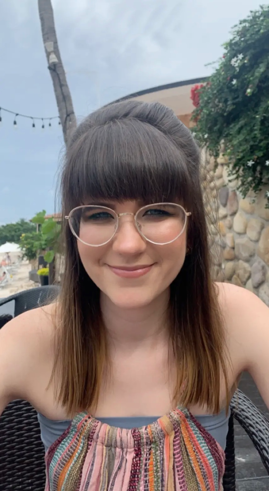

<kbd></kbd>

## About Lauren

I am a senior at Oregon State University. I am currently in the process of obtaining my Bachelor of Science degree in Computer Science. My applied option is in Human Computer Interaction, where I focus on making the user experience as pleasing and effective for the user as possible. 

This field has allowed me to explore different areas of computer science, from back-end database work to more artistic front-end work. I value all aspects of computer science because it is necessary for everything to work together to create a positive experience for the user. 

Once I obtain my BS degree in Computer Science, I hope to use what I have learned to make a difference in this field. I am excited to work in the industry and to be a part of a team working towards a bigger goal in technology. 

My links to my projects and LinkedIn are linked below. These will help provide a better understanding of my past work and qualifications in the field of Computer Science. 

### Lauren's Links

Below are the my links to my other work and experience that you can browse to gain a better understanding of me, as a programmer. 

**My Projects**

Click here to learn about the different projects I have contributed to or am currenly working on: [Lauren's Projects:](./projects.md)

**My Network**

Click here to view my LinkedIn profile: [Lauren's LinkedIn:](https://www.linkedin.com/in/lauren-galle-775724187/)

Click here to visit see the different GitHub repositories I have worked on: [Lauren's GitHub:](https://github.com/laurengalle)
